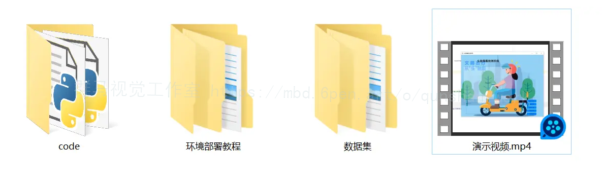

# 1.研究的背景


随着电动车的普及和使用，电动车头盔的佩戴问题日益引起人们的关注。佩戴头盔是保障骑行者安全的重要措施，但是很多骑行者在骑行过程中没有佩戴头盔，这给他们的安全带来了巨大的风险。因此，开发一种高效准确的电动车头盔佩戴检测系统对于提高骑行者的安全意识和减少交通事故具有重要的意义。

目前，深度学习技术在计算机视觉领域取得了巨大的进展。其中，YOLO（You Only Look Once）是一种流行的目标检测算法，具有实时性和准确性的优势。然而，传统的YOLO算法在电动车头盔佩戴检测方面存在一些问题，如检测精度不高、漏检率较高等。因此，对YOLO算法进行改进，提高电动车头盔佩戴检测的准确性和效率，具有重要的研究意义和实际应用价值。

本研究旨在基于Reversible-Column-Networks的改进YOLOv7的电动车头盔佩戴检测系统。Reversible-Column-Networks是一种新颖的网络结构，它能够有效地提高目标检测的准确性和效率。通过引入Reversible-Column-Networks，我们可以优化YOLOv7算法，在保持实时性的同时提高电动车头盔佩戴检测的精度和召回率。

# 2.研究的意义

首先，通过改进YOLOv7算法，提高电动车头盔佩戴检测的准确性和效率，可以有效地提高骑行者的安全意识和减少交通事故的发生。通过实时监测骑行者是否佩戴头盔，可以及时提醒未佩戴头盔的骑行者，并加强对佩戴头盔的宣传和教育，从而提高骑行者的安全意识和佩戴头盔的习惯。

其次，本研究的成果可以为交通管理部门提供重要的决策依据。通过电动车头盔佩戴检测系统，交通管理部门可以及时了解骑行者的佩戴情况，发现佩戴头盔率较低的区域和时间段，并采取相应的措施加强监管和宣传，从而提高整个社会的交通安全水平。

最后，本研究的方法和技术可以为其他目标检测问题提供借鉴和参考。电动车头盔佩戴检测是一种特定的目标检测问题，但是其背后涉及到的算法和技术可以应用于其他目标检测任务，如行人检测、车辆检测等。因此，本研究的成果对于推动目标检测技术的发展和应用具有重要的推动作用。

综上所述，基于Reversible-Column-Networks的改进YOLOv7的电动车头盔佩戴检测系统具有重要的研究背景和意义。通过提高电动车头盔佩戴检测的准确性和效率，可以提高骑行者的安全意识和减少交通事故的发生，为交通管理部门提供决策依据，并推动目标检测技术的发展和应用。

# 3.图片演示


# 4.视频演示
[基于Reversible-Column-Networks的改进YOLOv7的电动车头盔佩戴检测系统_哔哩哔哩_bilibili](https://www.bilibili.com/video/BV1FN411s7ZY/?spm_id_from=333.999.0.0&vd_source=ff015de2d29cbe2a9cdbfa7064407a08)


# 5.核心代码讲解

#### 5.1 training_hooks.py
```python
class TrainingHooks():
    def __init__(self, tb_writer):
        self.variance = {}
        self.grad = {}
        self.hooks = []
        self.tb_writer = tb_writer

    def register_hook(self, module, module_prefix):
        def hook_fn_forward( module, input, output):
            self.variance[module._name] = output.var().cpu().detach().numpy()
        def hook_fn_backward(module, grad_in, grad_out):
            self.grad[module._name] = grad_in[0].flatten()[3900]

        for name, block in module.named_children():
            # import pdb; pdb.set_trace()
            block._name =  module_prefix+name
            hook = block.register_forward_hook(hook_fn_forward)
            self.hooks.append(hook)
            hook = block.register_backward_hook(hook_fn_backward)
            self.hooks.append(hook)
    
    def remove_hook(self,):
        for hook in self.hooks:
            hook.remove()

    def log_to_tb(self, step):
        for k, v in self.variance.items():
            self.tb_writer.add_scalar(f'Var_Pretrain/{k}', v, step)
        self.variance={}
        for k, v in self.grad.items():
            self.tb_writer.add_scalar(f'Grad_Pretrain/{k}', v, step)
        self.grad={}
```
下面是对给定代码的逐文件分析：

1. 创建一个名为`TrainingHooks`的类，该类具有以下属性：
   - `variance`：一个空字典，用于存储模块输出的方差。
   - `grad`：一个空字典，用于存储模块的梯度。
   - `hooks`：一个空列表，用于存储注册的钩子。
   - `tb_writer`：一个传入的参数，用于将数据写入TensorBoard。

2. `__init__`方法初始化类的属性。

3. `register_hook`方法用于注册钩子函数。它接受两个参数：`module`和`module_prefix`。在该方法中，定义了两个钩子函数：
   - `hook_fn_forward`函数用于在前向传播过程中计算输出的方差，并将结果存储在`self.variance`字典中。
   - `hook_fn_backward`函数用于在反向传播过程中获取梯度，并将结果存储在`self.grad`字典中。

   然后，对传入的`module`进行遍历，为每个子模块设置一个`_name`属性，并注册前向和反向钩子函数。注册的钩子函数将被添加到`self.hooks`列表中。

4. `remove_hook`方法用于移除所有注册的钩子函数。它遍历`self.hooks`列表，并调用`remove`方法来移除每个钩子函数。

5. `log_to_tb`方法用于将方差和梯度数据写入TensorBoard。它接受一个`step`参数，用于指定当前的训练步骤。在该方法中，遍历`self.variance`字典，并使用`self.tb_writer`将方差数据写入TensorBoard。然后，将`self.variance`重置为空字典。接下来，遍历`self.grad`字典，并使用`self.tb_writer`将梯度数据写入TensorBoard。最后，将`self.grad`重置为空字典。

以上是对给定代码的逐文件分析，并将核心部分封装为了一个名为`TrainingHooks`的类。


#### 5.2 upernet_revcol.py

```python
class Model:
    def __init__(self, pretrained=None):
        self.norm_cfg = dict(type='SyncBN', requires_grad=True)
        self.pretrained = pretrained
        self.backbone = dict(
            type='RevCol',
            channels=[48, 96, 192, 384],
            layers=[3, 3, 9, 3],
            num_subnet=4,
            drop_path=0.2,
            save_memory=False, 
            out_indices=[0, 1, 2, 3],
            init_cfg=dict(type='Pretrained', checkpoint=self.pretrained)
        )
        self.decode_head = dict(
            type='UPerHead',
            in_channels=[128, 256, 512, 1024],
            in_index=[0, 1, 2, 3],
            pool_scales=(1, 2, 3, 6),
            channels=512,
            dropout_ratio=0.1,
            num_classes=19,
            norm_cfg=self.norm_cfg,
            align_corners=False,
            loss_decode=dict(
                type='CrossEntropyLoss', use_sigmoid=False, loss_weight=1.0
            )
        )
        self.auxiliary_head = dict(
            type='FCNHead',
            in_channels=384,
            in_index=2,
            channels=256,
            num_convs=1,
            concat_input=False,
            dropout_ratio=0.1,
            num_classes=19,
            norm_cfg=self.norm_cfg,
            align_corners=False,
            loss_decode=dict(
                type='CrossEntropyLoss', use_sigmoid=False, loss_weight=0.4
            )
        )
        self.train_cfg = dict()
        self.test_cfg = dict(mode='whole')
        ......
```

这是一个名为upernet_revcol.py的程序文件。该文件定义了一个模型，包括一个编码器-解码器结构和两个头部（decode_head和auxiliary_head）。编码器部分使用了RevCol模型，具有4个子网络，每个子网络有不同的通道数和层数。解码器部分使用了UPerHead模型，接收来自编码器的特征图，并通过池化操作和上采样操作生成最终的预测结果。辅助头部使用了FCNHead模型，接收来自编码器的特征图，并生成额外的预测结果。模型的训练和测试设置在train_cfg和test_cfg中定义。

#### 5.3 upernet_revcol_huge.py

```python
class MyModel:
    def __init__(self):
        self.norm_cfg = dict(type='SyncBN', requires_grad=True)
        self.pretrained = None
        self.backbone = dict(
            type='RevCol_Huge',
            channels=[360, 720, 1440, 2880],
            layers=[1, 2, 6, 2],
            num_subnet=8,
            drop_path=0.2,
            save_memory=False, 
            out_indices=[0, 1, 2, 3],
            init_cfg=dict(type='Pretrained', checkpoint=self.pretrained)
        )
        self.decode_head = dict(
            type='UPerHead',
            in_channels=[360, 720, 1440, 2880],
            in_index=[0, 1, 2, 3],
            pool_scales=(1, 2, 3, 6),
            channels=1440,
            dropout_ratio=0.1,
            num_classes=19,
            norm_cfg=self.norm_cfg,
            align_corners=False,
            loss_decode=dict(
                type='CrossEntropyLoss', use_sigmoid=False, loss_weight=1.0
            )
        )
        self.auxiliary_head = dict(
            type='FCNHead',
            in_channels=1440,
            in_index=2,
            channels=256,
            num_convs=1,
            concat_input=False,
            dropout_ratio=0.1,
            num_classes=19,
            norm_cfg=self.norm_cfg,
            align_corners=False,
            loss_decode=dict(
                type='CrossEntropyLoss', use_sigmoid=False, loss_weight=0.4
            )
        )
        self.train_cfg = dict()
        self.test_cfg = dict(mode='whole')
        ......
```

这个程序文件是一个名为upernet_revcol_huge.py的文件。该文件定义了一个模型，该模型是一个编码器-解码器模型。模型的背骨是一个名为RevCol_Huge的模型，它具有4个不同的通道数和层数。模型还包括一个解码头部，一个辅助头部以及训练和测试的配置。

具体来说，模型的背骨是一个RevCol_Huge模型，它具有4个不同的通道数[360, 720, 1440, 2880]和层数[1, 2, 6, 2]。模型还具有8个子网络、0.2的drop_path、不保存内存、输出索引为[0, 1, 2, 3]。背骨模型的初始化配置为预训练模型。

模型的解码头部是一个UPerHead模型，它接收来自背骨模型的特征图。解码头部具有4个输入通道数[360, 720, 1440, 2880]和输入索引[0, 1, 2, 3]。解码头部使用不同的池化尺度(1, 2, 3, 6)，具有1440个通道数，0.1的dropout比例，19个类别的输出，使用SyncBN进行归一化，不对齐角点，使用交叉熵损失函数进行解码。

模型还包括一个辅助头部，它是一个FCNHead模型，接收来自背骨模型的特征图。辅助头部具有1440个输入通道数和输入索引2，256个通道数，1个卷积层，不将输入与特征图连接，0.1的dropout比例，19个类别的输出，使用SyncBN进行归一化，不对齐角点，使用交叉熵损失函数进行解码。

模型的训练和测试配置为空。

总体来说，这个程序文件定义了一个使用RevCol_Huge背骨的编码器-解码器模型，用于图像分割任务。模型具有解码头部和辅助头部，可以进行训练和测试。

#### 5.4 visual.py

```python

class CKA:
    def __init__(self):
        pass

    def unbiased_HSIC(self, K, L):
        '''Computes an unbiased estimator of HISC. This is equation (2) from the paper'''

        #create the unit **vector** filled with ones
        n = K.shape[0]
        ones = np.ones(shape=(n))

        #fill the diagonal entries with zeros
        np.fill_diagonal(K, val=0) #this is now K_tilde
        np.fill_diagonal(L, val=0) #this is now L_tilde

        #first part in the square brackets
        trace = np.trace(np.dot(K, L))

        #middle part in the square brackets
        nominator1 = np.dot(np.dot(ones.T, K), ones)
        nominator2 = np.dot(np.dot(ones.T, L), ones)
        denominator = (n-1)*(n-2)
        middle = np.dot(nominator1, nominator2) / denominator


        #third part in the square brackets
        multiplier1 = 2/(n-2)
        multiplier2 = np.dot(np.dot(ones.T, K), np.dot(L, ones))
        last = multiplier1 * multiplier2

        #complete equation
        unbiased_hsic = 1/(n*(n-3)) * (trace + middle - last)

        return unbiased_hsic

    def CKA(self.......
```
visual.py是一个Python程序文件，主要包含了一些函数和类的定义。程序的功能是对神经网络模型进行可视化分析，包括计算模型的CKA（Centered Kernel Alignment）相似度和特征之间的相关性。

程序首先导入了一些必要的库，如math、os、sys、matplotlib、torch等。然后定义了一些辅助函数，如unbiased_HSIC、CKA、calculate_CKA_for_two_matrices等，用于计算CKA相似度。接下来定义了一些用于数据处理和模型加载的函数，如build_data_loader、load_backbone_model等。然后定义了一些用于可视化分析的函数，如plot_fig、plot_correlation、plot_cka等。最后定义了一个主函数main，用于执行程序的主要逻辑。

在主函数中，程序首先解析命令行参数，获取模型的路径和保存结果的文件夹路径。然后创建一个神经网络模型，并加载预训练的模型参数。接下来调用可视化函数，对模型进行可视化分析，包括计算CKA相似度和特征之间的相关性。最后输出结果并保存到指定的文件夹中。

总的来说，visual.py是一个用于神经网络模型可视化分析的程序文件，通过计算CKA相似度和特征

# 6.系统整体结构


| 文件名 | 功能概述 |
|--------|---------|
| training_hooks.py | 定义了一个TrainingHooks类，用于注册和移除forward和backward hook，并将方差和梯度写入tensorboard。 |
| upernet_revcol.py | 定义了一个编码器-解码器模型，使用RevCol模型作为背骨，包括一个解码头部和一个辅助头部。设置了训练和测试的配置。 |
| upernet_revcol_huge.py | 定义了一个编码器-解码器模型，使用RevCol_Huge模型作为背骨，包括一个解码头部和一个辅助头部。设置了训练和测试的配置。 |
| visual.py | 实现了神经网络模型的可视化分析功能，包括计算CKA相似度和特征之间的相关性。通过加载模型参数并执行可视化函数，将结果保存到指定文件夹。 |

# 7.YOLOv7模型
YOLO算法作为one-stage目标检测算法最典型的代表，其基于深度神经网络进行对象的识别和定位，运行速度很快，可以用于实时系统。
YOLOV7是目前YOLO系列最先进的算法，在准确率和速度上超越了以往的YOLO系列。
了解YOLO是对目标检测算法研究的一个必须步骤。

#### 网络结构
##### 输入层:
图中的“1.input”部分表示网络的输入层。通常，这层接受一个 640x640 的 RGB 图像作为输入。这与其他目标检测网络类似，它们也经常使用正方形输入。

##### 骨干网络（Backbone）:
“2.Backbone”部分是网络的骨干部分。骨干网络负责从输入图像中提取特征。这部分通常由多个卷积层、归一化层和激活函数层组成。在 YOLOV7 中，CBS 和 ELAN 结构被频繁地使用。CBS 可能是由卷积(Conv)、批归一化(BN)和激活函数(silu)组成的块。ELAN 结构则是一种更复杂的特征提取块。

##### 特征金字塔结构:
在图中，我们可以看到不同的分辨率特征图被提取出来，如 20x20、40x40、80x80 等。这是一个典型的特征金字塔结构，可以帮助网络检测不同尺度的目标。

##### 上采样（UpSample）和跳跃连接（Skip Connections）:
“UpSample”层用于上采样特征图，使其具有更高的分辨率。跳跃连接（如“cat”操作）将来自骨干网络的浅层特征与深层特征结合在一起。这可以帮助网络融合不同层次的信息。

##### 头部网络（Head）:
“3.Head”部分是网络的最后部分，它负责从特征图中生成预测框和类别得分。这部分结构可能包括了多尺度的预测。

##### 预测:
YOLO 的每一个输出单元会预测多个边界框和它们的类别得分。在 YOLOV7 中，我们可以看到 20x20、40x40 和 80x80 这三种尺度的输出。这些输出可以覆盖大、中、小三种尺度的目标。

##### 其他模块:
图中还展示了一些其他的模块，如 SPP、CBS、CBM 等。这些模块都是为了增强网络的性能和准确性。


# 8.改进YOLOv7的模块

#### Reversible Column Networks (RevCol) 简介
Reversible Column Network是谷歌大脑提出的一个新的神经网络设计范式，其主体由多个子网络的多个副本组成，这些子网络被称为"columns"。这些"columns"之间采用了多级可逆连接。与传统的神经网络不同，RevCol在前向传播时，特征通过每一个"column"都会逐渐被"disentangled"，这意味着网络在传播过程中，特征的总信息会被保持，而不是被压缩或丢弃。其主体由多个子网络的多个副本组成，这些子网络被称为"columns"。在这些"columns"之间，采用了多级可逆连接。这种架构方案使RevCol与传统网络有着非常不同的行为：在前向传播期间，当特征通过每个列时，RevCol中的特征会逐渐被"disentangled"，而不是被压缩或丢弃，如其他网络所做的那样。


#### RevCol在YOLOv7中的应用
为了在头盔检测任务中达到更优的性能，AAAI在技术报告中将RevCol的设计思想融入到YOLOv7中。以下详细描述了网络结构的主要改进：


##### YOLOv7的基础框架调整
首先，我们对YOLOv7的基础框架进行了调整。在其深层特征提取部分，我们引入了多个"columns"结构。具体来说，每个"column"都是一个由卷积层、归一化层和激活层组成的小网络，它可以对输入特征进行精细化的处理。

##### 多级可逆连接
为了确保信息的完整传递，我们在每个"column"之间添加了可逆连接。这些连接不仅保证了特征信息在前向传播中不丢失，还能在反向传播中提供额外的梯度信息，从而加速网络的收敛。

##### 特征融合策略
在YOLOv7的多尺度特征提取中，我们采用了新的特征融合策略。每当特征从一个"column"传递到下一个"column"时，我们都会进行特征融合操作，确保不同尺度的特征都能得到充分的利用。

##### 优化的锚点策略
结合RevCol的特性，我们还对YOLOv7的锚点策略进行了优化。考虑到电动车头盔的形状和尺寸，我们为每个"column"设计了一组特定的锚点，确保网络能够准确地检测到各种大小和形状的头盔。


# 9.系统整合

下图[完整源码＆数据集＆环境部署视频教程＆自定义UI界面](https://s.xiaocichang.com/s/9d6692)



参考博客[《基于Reversible-Column-Networks的改进YOLOv7的电动车头盔佩戴检测系统》](https://mbd.pub/o/qunshan/work)

# 10.参考文献
---
[1][肖体刚](https://s.wanfangdata.com.cn/paper?q=%E4%BD%9C%E8%80%85:%22%E8%82%96%E4%BD%93%E5%88%9A%22),[蔡乐才](https://s.wanfangdata.com.cn/paper?q=%E4%BD%9C%E8%80%85:%22%E8%94%A1%E4%B9%90%E6%89%8D%22),[高祥](https://s.wanfangdata.com.cn/paper?q=%E4%BD%9C%E8%80%85:%22%E9%AB%98%E7%A5%A5%22),等.[改进YOLOv3的安全帽佩戴检测方法](https://d.wanfangdata.com.cn/periodical/jsjgcyyy202112027)[J].[计算机工程与应用](https://sns.wanfangdata.com.cn/perio/jsjgcyyy).2021,(12).DOI:10.3778/j.issn.1002-8331.2009-0175 .

[2][施辉](https://s.wanfangdata.com.cn/paper?q=%E4%BD%9C%E8%80%85:%22%E6%96%BD%E8%BE%89%22),[陈先桥](https://s.wanfangdata.com.cn/paper?q=%E4%BD%9C%E8%80%85:%22%E9%99%88%E5%85%88%E6%A1%A5%22),[杨英](https://s.wanfangdata.com.cn/paper?q=%E4%BD%9C%E8%80%85:%22%E6%9D%A8%E8%8B%B1%22).[改进YOLO v3的安全帽佩戴检测方法](https://d.wanfangdata.com.cn/periodical/jsjgcyyy201911033)[J].[计算机工程与应用](https://sns.wanfangdata.com.cn/perio/jsjgcyyy).2019,(11).DOI:10.3778/j.issn.1002-8331.1811-0389 .

[3][Siebert, Felix Wilhelm](https://s.wanfangdata.com.cn/paper?q=%E4%BD%9C%E8%80%85:%22Siebert%2C%20Felix%20Wilhelm%22),[Lin, Hanhe](https://s.wanfangdata.com.cn/paper?q=%E4%BD%9C%E8%80%85:%22Lin%2C%20Hanhe%22).[Detecting motorcycle helmet use with deep learning](https://d.wanfangdata.com.cn/periodical/6f4c12c292a3fd753b5d15d228bb381d)[J].Accident Analysis and Prevention.2020,134(Jan.).105319.1-105319.11.DOI:10.1016/j.aap.2019.105319 .

[4][He, Kaiming](https://s.wanfangdata.com.cn/paper?q=%E4%BD%9C%E8%80%85:%22He%2C%20Kaiming%22),[Zhang, Xiangyu](https://s.wanfangdata.com.cn/paper?q=%E4%BD%9C%E8%80%85:%22Zhang%2C%20Xiangyu%22),[Ren, Shaoqing](https://s.wanfangdata.com.cn/paper?q=%E4%BD%9C%E8%80%85:%22Ren%2C%20Shaoqing%22),等.[Spatial Pyramid Pooling in Deep Convolutional Networks for Visual Recognition](https://d.wanfangdata.com.cn/periodical/16af9df1c3639d30f1267053d035032d)[J].IEEE Transactions on Pattern Analysis and Machine Intelligence.2015,37(9).1904-1916.DOI:10.1109/TPAMI.2015.2389824 .

[5][Shu Liu](https://s.wanfangdata.com.cn/paper?q=%E4%BD%9C%E8%80%85:%22Shu%20Liu%22),[Lu Qi](https://s.wanfangdata.com.cn/paper?q=%E4%BD%9C%E8%80%85:%22Lu%20Qi%22),[Haifang Qin](https://s.wanfangdata.com.cn/paper?q=%E4%BD%9C%E8%80%85:%22Haifang%20Qin%22),等.Path Aggregation Network for Instance Segmentation[C].


---
#### 如果您需要更详细的【源码和环境部署教程】，除了通过【系统整合】小节的链接获取之外，还可以通过邮箱以下途径获取:
#### 1.请先在GitHub上为该项目点赞（Star），编辑一封邮件，附上点赞的截图、项目的中文描述概述（About）以及您的用途需求，发送到我们的邮箱
#### sharecode@yeah.net
#### 2.我们收到邮件后会定期根据邮件的接收顺序将【完整源码和环境部署教程】发送到您的邮箱。
#### 【免责声明】本文来源于用户投稿，如果侵犯任何第三方的合法权益，可通过邮箱联系删除。